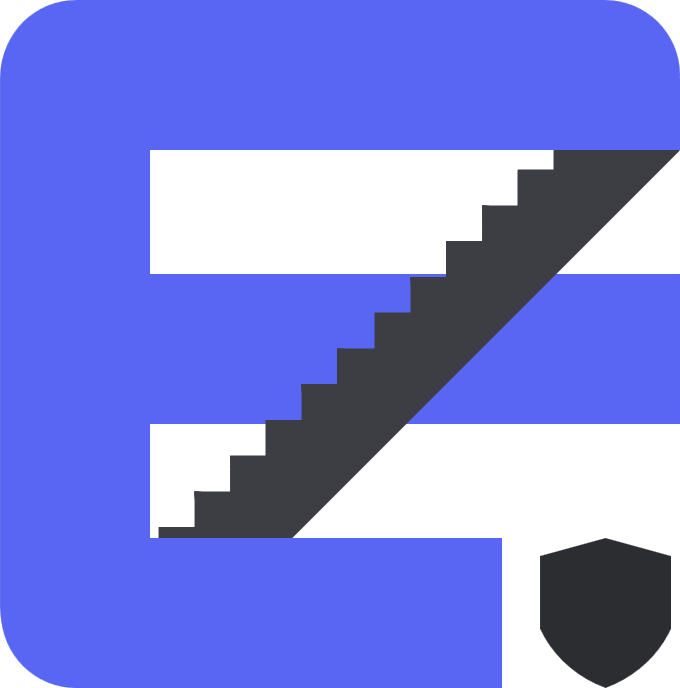

<a id="readme-top"></a>

<br />
<div align="center">
  <a href="https://github.com/numverse/Shelter-Client">
    
  </a>
  <h3 align="center">Shelter-Client</h3>
  <p align="center">
    Client-side portion of Shelter
  </p>
</div>

### Built With

* [![Typescript][Typescript]](https://img.shields.io/badge/typescript-35495E?style=for-the-badge&logo=typescript)
* [![Bun][bun]](https://img.shields.io/badge/bun-35495E?style=for-the-badge&logo=bun)
* [![Vue][Vue.js]](https://img.shields.io/badge/Vue.js-35495E?style=for-the-badge&logo=vuedotjs)
* [![Lucide][lucide]](https://img.shields.io/badge/lucide-35495E?style=for-the-badge&logo=lucide)
* [![Tailwind][TailwindCSS]](https://img.shields.io/badge/TailwindCSS-35495E?style=for-the-badge&logo=tailwindcss)

## Contributing

### Prerequisites

This project uses [Bun](https://bun.sh/). Please install it from the official homepage.

### Installation

1. Clone the repo
   ```sh
   git clone https://github.com/numverse/Shelter-Client.git
   ```
2. Install NPM packages
   ```sh
   bun install
   ```

### Important

<b>Adhere to the ESLint rules!</b>

1. Test your changes by running a devserver
   ```sh
   bun run dev
   ```
2. Create a new branch
3. Commit changes to that branch
4. Open a pull request
